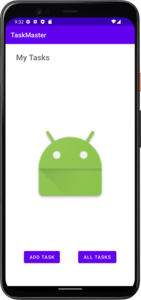

# TaskMaster

TaskMaster is a task manager app for Android.

## Lab 26

Implements basic activities for adding a task, viewing all tasks, and the main app screen.

### Homepage 

The homepage has a placeholder image and two buttons, one that links to the add a task activity and another that links to the all tasks activity.

### Add a Task

The add a task view takes user input for a task name and description. Submitting the task displays an animated "submitted" message as well as increments the task count. These features are superficial at the moment and will reset each time the view is loaded.

### All Tasks

The all tasks view will someday be home to a list of current tasks. Currently there is just a placeholder image and the title.

