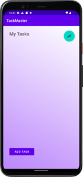
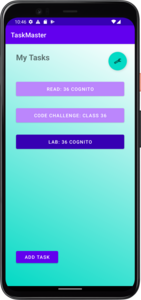
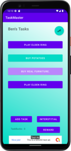
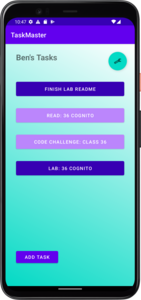
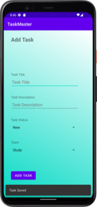

# TaskMaster

TaskMaster is a task manager app for Android.

## Changelog

### Lab 26

- Added a homepage that has a placeholder image and two buttons, one that links to the add a task activity and another that links to the all tasks activity.
- Added a task view that takes user input for a task name and description. 
  - Submitting the task displays an animated "submitted" message as well as increments the task count. 
  - These features are superficial at the moment and will reset each time the view is loaded.
- Added an all tasks view that will someday be home to a list of current tasks. Currently there is just a placeholder image and the title.

### Lab 27

- Re-worked the homepage to include a list of 3 static tasks.
- Added a task details activity.
  - Each task on the homepage links to a details activity view that grabs the name of the task from the button clicked on the main activity.
  - Each task's details page also includes the same bit of lorem ipsum for now.
- Added a settings activity.
  - The user can input a username and save this username via SharedPreferences.
  - The saved username is displayed on the main activity in the format "{username}'s tasks" and loads every time the main activity is resumed.
  - The value in the textedit field also reflects the updated change when the user returns.
  - If the user hasn't saved a username yet or changes the value to an empty string, the main activity displays "My Tasks".

### Lab 28

- Added a model for tasks with an enum for possible task status.
- Replaced static task buttons on the homepage with a RecyclerView list of task buttons.
  - Tasks are currently reading for a hard-coded list of tasks.
  - Task buttons are dynamically colored based on their task status.
- Updated the task details activity to include task status and description for the specific task.

### Lab 29

- Added a local SQLite database with Android Room.
  - New tasks are saved to the database.
  - On resume the main page pulls the most recent task data from the database.
- Add task activity is updated to include a spinner for task status.
  - A snackbar appears after adding a task to let the user know the task was saved.
  - Fields are cleared and focus it put on the title edit text for a new task to be input.

### Lab 31

- Updated appearance
  - Added animated background to main, settings, and add task pages.
  - Added gradient static backgrounds based on status to the task details page.
- Added more robust Espresso tests for the main, add task, and settings activities.
  - Tests clear data before testing and remove any data created post test.

### Lab 32

- Removes local Room database.
- Removes local models.
- Adds cloud Amplify database.
  - Adds GraphQL schema and Amplify models.
  - RecyclerView is filled from an Amplify api query.
  - Add task activity uses Amplify api to add items to the cloud.
- Adds EnumUtil class to allow for continued usage of TaskStatus enums.
- Tests reworked to use Amplify cloud database.

### Lab 33

- Add new Team feature.
  - Tasks are part of a team when created.
  - Currently 3 hard coded teams exist: Work, Home, Study.
  - Spinner selector displays team choices when creating a task.
- Update to settings activity to allow saving a current team to shared preferences.
  - The main activity filters the recycler view based on the current saved preference.

### Lab 34

- Cleans up commented code, whitespace and unused imports.
- Fixes any Android Studio warnings related to accessibility. 
- Includes an .aap release.
- Adds a privacy policy to comply with the Google Play Store.
- App is currently in review on the Google Play Store.
  - After review the Play Store link will be 

### Lab 35

- Adds Amplify Auth
  - If the user is not logged in the app launches to the log in activity.
  - Login activity has a log in form as well as a button to a sign up activity.
  - The sign up activity has a form for creating an Amplify Auth hosted account
    - After successful creation the user is forwarded to the verify activity.
  - The verify activity allow the user to enter the verification code received via email.
    - After successful creation the user is forwarded to the log in activity.
- The currently logged in user's nickname appears as before with "My Tasks" if the user's name is an empty string.
- The all tasks activity has been removed as well as the button for all tasks on the main activity.

### Lab 37

- Adds Amplify Storage
  - Adding a task has an optional attachement component.
    - Tapping the attachement button brings up the Android file picker and saves the file with the task.
    - Currently only jpeg or png files are accepted.
    - The attachement is saved in AWS S3 and the key is saved with the task in DynamoDB.
  - The task details activity has been updated to display the image of the task if one exists.

### Lab 38
- Updates add task to include image thumbnail preview.
- Adds an intent filter for images to initiate an new task.
  - Image from intent updates image thumbnail and saves along with the task
  - Intent image uploads to S3.

### Lab 39
- Refacors code into smaller functions in add task activity.
- Adds locations to tasks
  - Updates add task to grab the current location.
    - Adds lat and lon values to the task
    - Adds street address value to the task
  - Updates task view activity to display the street address of the task.

### Lab 41
- Adds analytic events for [onResume()](./readme-images/lab-41/onresume.png) and [onCreate()](./readme-images/lab-41/oncreate.png). 
- Adds a text to speech button on the task detail activity that will read the task title and the task description.
- Adds text identify feature when adding an image to a task. Identified text will appear in the task description text edit.

### Lab 42
- Adds Google AdMob banner ad to the base of the main activity.
- Adds AdMob interstitial ad button proof of concept.
- Adds AdMob rewarded ad button proof of concept with "taskbucks" reward of 10.
   

## Activities

### Homepage 

The homepage displays a RecyclerView list of tasks that link to dynamically created task detail activities. All tasks are retrieved from an AWS Amplify database. If there is a current team set, the tasks displayed are filtered by that team. The top right of the main activity has a floating action button that links to the settings activity. The main page also still includes buttons that link to the add task activity and all tasks activity. The background slowly blends two backgrounds. 

The homepage also includes concepts for ads. The base of the homepage has a banner ad. There are two buttons for demoing interstitial and rewarded ads as well. Rewarded ads give "taskbucks" which are reflected on the page.

### Task Details

The task details activity displays a title, status, and description for each task. Tasks also will display an optional attachement and street address taken from GPS location. The data for the tasks are stored in the cloud via an Amplify database. The task background also changes with the status of the task (same colors as main page buttons). The text description and title can be read aloud with text-to-speech option via floating button.

### Settings

The settings page allows a user to change their username and current team and save it in SharedPreferences. The saved username is reflected on the homepage after saving one. Submitting an empty string will revert the display back to "My Tasks". The selected team behaves like a filter for the tasks displayed on the main activity. Background animates in the same way the main activity animates.

### Add a Task

The add a task view takes user input for a task name, description, task status and team. The location of the device at the time of task creation will be saved with the task as well. Submitting a new task will display a confirmation snackbar, clear the form and place the focus on the title edit text. New tasks are saved in the cloud and visible immediately after returning to the homepage. Images can also be attached to tasks directly in Taskmaster or outside via sharing an image to the application. Attached images are analyzed fro text and the text is applied automaticaly to the description field if found.

### Log In, Sign Up, Verify

The sign up and vefify activities control the Amplify Auth initial setup. The log in page handles future log ins. Log outs are preformed in the settings activity.

