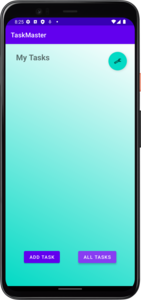
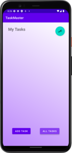
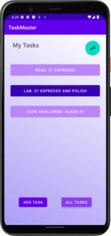
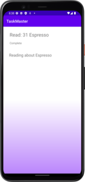
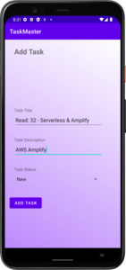
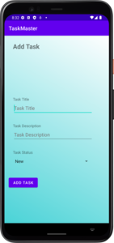
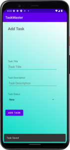

# TaskMaster

TaskMaster is a task manager app for Android.

## Changelog

### Lab 26

- Added a homepage that has a placeholder image and two buttons, one that links to the add a task activity and another that links to the all tasks activity.
- Added a task view that takes user input for a task name and description. 
  - Submitting the task displays an animated "submitted" message as well as increments the task count. 
  - These features are superficial at the moment and will reset each time the view is loaded.
- Added an all tasks view that will someday be home to a list of current tasks. Currently there is just a placeholder image and the title.

### Lab 27

- Re-worked the homepage to include a list of 3 static tasks.
- Added a task details activity.
  - Each task on the homepage links to a details activity view that grabs the name of the task from the button clicked on the main activity.
  - Each task's details page also includes the same bit of lorem ipsum for now.
- Added a settings activity.
  - The user can input a username and save this username via SharedPreferences.
  - The saved username is displayed on the main activity in the format "{username}'s tasks" and loads every time the main activity is resumed.
  - The value in the textedit field also reflects the updated change when the user returns.
  - If the user hasn't saved a username yet or changes the value to an empty string, the main activity displays "My Tasks".

### Lab 28

- Added a model for tasks with an enum for possible task status.
- Replaced static task buttons on the homepage with a RecyclerView list of task buttons.
  - Tasks are currently reading for a hard-coded list of tasks.
  - Task buttons are dynamically colored based on their task status.
- Updated the task details activity to include task status and description for the specific task.

### Lab 29

- Added a local SQLite database with Android Room.
  - New tasks are saved to the database.
  - On resume the main page pulls the most recent task data from the database.
- Add task activity is updated to include a spinner for task status.
  - A snackbar appears after adding a task to let the user know the task was saved.
  - Fields are cleared and focus it put on the title edit text for a new task to be input.

### Lab 31

- Updated appearance
  - Added animated background to main, settings, and add task pages.
  - Added gradient static backgrounds based on status to the task details page.
- Added more robust Espresso tests for the main, add task, and settings activities.
  - Tests clear data before testing and remove any data created post test.

## Activities

### Homepage 

The homepage displays a RecyclerView list of tasks that link to dynamically created task detail activities. All tasks are retrieved from a local SQLite Room database. The top right of the main activity has a floating action button that links to the settings activity. The main page also still includes buttons that link to the add task activity and all tasks activity. The background slowly blends two backgrounds.

### Task Details

The task details activity displays a title, status, and description for each task. The data for the tasks are stored in the local Room database. The task background also changes with the status of the task (same colors as main page buttons).

### Settings

The settings page allows a user to change their username and save it in SharedPreferences. The saved username is reflected on the homepage after saving one. Submitting an empty string will revert the display back to "My Tasks". Background animates in the same way the main activity animates.

### Add a Task

The add a task view takes user input for a task name, description and task status. Submitting a new task will display a confirmation snackbar, clear the form and place the focus on the title edit text.

### All Tasks

The all tasks view will someday be home to a list of current tasks. Currently there is just a placeholder image and the title.

